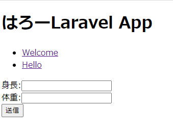

# Laravel入門編4章フォーム
ここまでLaravelとMVCの関係や、  
routeやController、bladeなどの学習をしてきました。  
諸事情により説明できなかった部分もあったため、  
BMI計測機能を作りながら説明できなかったPOSTリクエストやフォームについて説明します。

## BMI計測機能
フォームに身長体重を入力して送信ボタンを押すと、  
BMIが表示されます。(~~JavaScriptだけでできるじゃん~~)

## Controllerを作成する
BMIControllerという名前のControllerを作成したいと思います。
```
php artisan make:controller BMIController
```


## routeを実装する
BMIControllerをuseするのを忘れないようにしてください。 
今回はあまり恩恵は少ないのですが、名前付きルートを使用しました。 
> web.php
```php
// 忘れないように！！
use App\Http\Controllers\BMIController;

// name()は名前付きルート
Route::get('/bmi', [BMIController::class, 'index'])->name('bmi');

Route::post('/bmi', [BMIController::class, 'store'])->name('bmi.store');
```


## 名前付きルート
名前付きルートはroute関数などで、  
そのルートの名前で呼び出します。  
するとそのルートのパスが帰ってきます。  
複雑なパスや、パスの変更が多いときにとても大きな恩恵を受けます。

> 名前付きルートの例
```php
Route::get('/books/{bookId}/reviews/{reviewId}', [ReviewController::class, 'show'])->name('reviews.show');

// bladeなどで
<a href="{{ route('reviews.show', ['bookId' => 3, 'reviewId' => 4])}}">レビュー詳細</a>

// このように展開されます
<a href="/books/3/reviews/4">レビュー詳細</a>
```


## bladeを追加する
bmi.blade.phpという名前で作成します。
```
touch ./resources/views/bmi.blade.php
```

POSTリクエストが送信できることを確認したいのでフォームを作成します。
```html
@extends('layouts.app')

@section('title')
BMIを測定
@endsection
@section('content')
<form method="POST" action="{{ route('bmi.store') }}">
    @csrf
    <div>
        身長:<input type="text" name="height">
    </div>
    <div>
        体重:<input type="text" name="weight">
    </div>
    <button type="submit">送信</button>
        
</form>
@endsection

```

## BMIControllerからbmi.blade.phpを返す
このままだとbmi.blade.phpを表示することができないので、  
routeで実装したようにBMIControllerにindexメソッドを追加して、  
そこからbmi.blade.phpを返すようにします。
> routes/web.php
```php
Route::get('/bmi', [BMIController::class, 'index'])->name('bmi');
```

> BMIController::class
```php
<?php

namespace App\Http\Controllers;

use Illuminate\Http\Request;

class BMIController extends Controller
{
    //

    public function index()
    {
        return view('bmi');
    }
}
```

```/bmi```にアクセスすると以下のような画面が表示されると思います。


早速送信を押してみましょう。  
エラーが表示されて今いました。  
どうやらBMIControllerにstoreメソッドは存在しないぞ、と言われているようです。
```
BadMethodCallException
Method App\Http\Controllers\BMIController::store does not exist.
```
BMIControllerにPOST先のメソッドを実装していなかったので当然といえば当然ですね。

## POST先を実装する
web.phpを見たところPOST先はBMIControllerのstoreメソッドのようです。
```php
Route::post('/bmi', [BMIController::class, 'store'])->name('bmi.store');
```

本当にPOSTされたのかわかりにくいので、「POSTされた」と表示することにします。
```php
<?php

namespace App\Http\Controllers;

use Illuminate\Http\Request;

class BMIController extends Controller
{
    //

    public function index()
    {
        return view('bmi');
    }

    public function store()
    {
        echo "POSTされた";
    }
}
```

再度送信ボタンを押してみます。  
うまくいけば「POSTされた」と表示されます。

## パラメーターを受け取る
storeメソッドの引数にRequest型の$request引数を追加してください。
```
public function store(Request $request)
{
    echo "POSTされた";
}
```

パラメーターは以下のようにして取得することができます。
```php
public function store(Request $request)
{
    // 個別に取得する
    $height = $request->input('height');
    $weight = $request->input('weight');

    // まとめて取得する(配列として取得される)
    $heightAndWeight = $request->only('height', 'weight');

    // すべて取得する(配列として取得される)
    $all = $request->all();
    echo "POSTされた";
}
```

いろいろな方法がありますが、今回は、inputで取得します。  
```php
public function store(Request $request)
{
    // 個別に取得する
    $height = $request->input('height');
    $weight = $request->input('weight');

    echo "height:" . $height . ", weight:"  .  $weight;
}

適当にフォームに入力して送信すると入力した値が画面に表示されると思います。
```

## 計算処理を実装する
本来はModelに実装すべきですが、本題はそこではないのでControllerに実装します。
