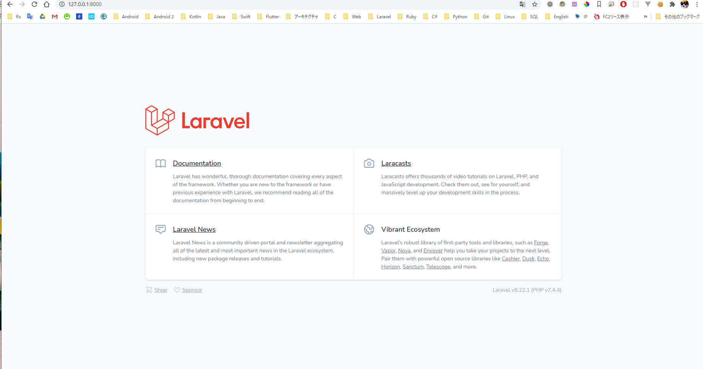
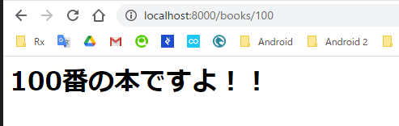
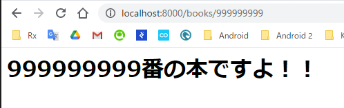

# Laravel 入門編 1章 Route入門
今回はLaravelのRouteという機能を触ります。

## 前回の復習
前回は以下のことについてできていれば十分かと思います。  
* Composerって便利なんだー
* プロジェクト作成できた！！
* MVCモデルについての理解
* MVCモデルとLaravelの関係

特にMVCモデルとMVCモデルとLaravelの関係を忘れないようにしてください。  
忘れてしまっている場合は読み直すようにしてください。

## Routeとは
フレームワークを使わないPHPでは
hoge.phpと作成するとhoge.phpでアクセスでき、  
fuga.phpと作成するとfuga.phpとアクセスできました。  
(apacheやnginxの設定にもよりますが)  
ではLaravelではどのようにすれば、このRouteをプログラムすることができるでしょうか？  
LaravelではRouteという仕組みでパス（URL）を決定します。

## Hello Route
早速プロジェクトディレクトリを開き
```./routes/web.php```をエディタで開きましょう。  

```php
<?php

use Illuminate\Support\Facades\Route;

/*
|--------------------------------------------------------------------------
| Web Routes
|--------------------------------------------------------------------------
|
| Here is where you can register web routes for your application. These
| routes are loaded by the RouteServiceProvider within a group which
| contains the "web" middleware group. Now create something great!
|
*/

Route::get('/', function () {
    return view('welcome');
});

```
> まだ開発用サーバーを起動でいていない人はphp artisan serveで起動してください。

 
以下の様なコードが書かれています。  
見てみると```'/'```パスのような表記が見えます。 
早速ブラウザで起動したサーバーへアクセスします。
```php
Route::get('/', function () {
    return view('welcome');
});

```
Welcome画面が表示されると思います。
<div></div>

次に自分でRouteを作ってみます
```php
Route::get('/hello', function(){
    echo "<h1>Hello Route</h1>";
});
```
ブラウザでアクセスしてみます ```http://127.0.0.1:8000/hello```
> ドメインやホストPortは各自の環境に合わせ変更してください。  
ミスがなければ画面に「Hello Route」と表示されると思います。

## パラメーターを受け取るRoute
これだけだと全くLaravelのRouteは何もできないなといった気分になります。  
しかしRouteは複雑なパスに対応することも可能です。

しかしいきなり複雑なパス(URL)と言われても何が何だかなので、  
QiitaのURLの構造を見てみることにします。  
```https://qiita.com/syuilo/items/0800d7e44e93203c7285```  
```https://qiita.com/YuzuRyo61/items/58d8c2f6a2c2bbfb7eda```  
以下ような構成になっているのだろうと推測できます。
```
https://qiita.com/ユーザー名/items/記事のid
```

LaravelのRouteではこのようなパスを簡単に実現することができます。  
> データベースは使えないのであまり面白いことはできませんが・・

```php
Route::get('/books/{bookNo}', function($bookNo){
    echo "<h1>" . $bookNo . "番の本ですよ！！</h1>";
});
```
　　
保存して早速ブラウザでアクセスしてみます。
```http://localhost:8000/books/100```  

  

他のURLも試してみます  
 ```http://localhost:8000/books/999999999```  
  

とても面白いですね。  
データベースなどと組み合わせることを考えるととても夢が広がります。  

Routeは他にもいろいろな機能がありますが、その前に他の機能について説明しながら深めたいと思います。

## POSTリクエスト

以下のようにすることでPOSTリクエストも可能になりますが、  
今説明するとややこしくなるため後半説明します。
```php
Route::post(パス, 関数);
```


## まとめ
* RouteはPathと処理を関数へマッピングしてくれる
* PathはRouteはパラメーターを受けることができる
