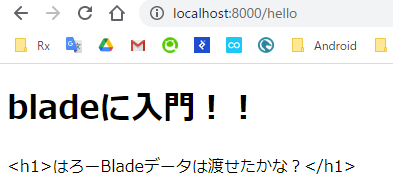

# Laravel入門編 ３章 blade入門
今まではControllerやRouteで直接echoやprintを使って表示させていましたが、  
しかしそれは構造的ではないためとても分かりにくいです。  
さらにphpをかけないデザイナーにとってもハードルが高いです。  
しかしbladeはHTMLらしさを失うことなく、PHPの変数などを表示することもできます。  

## bladeファイルを作成する
~~以下のコマンドで作成することができます。~~  
残念ながらbladeを作成するartisanコマンドは標準ではありません。  
```./resources/views/```に手動で
```hello.blade.php```ファイルを作成しましょう。

~~玄人っぽく見せたいので私はtouchコマンドで作成します。~~~
```
touch ./resources/views/hello.blade.php
```

VSCodeの場合はcodeコマンドでも作成できます。
```
code ./resources/views/hello.blade.php
```

## bladeにコードを書く

なんとなくhello.blade.phpにHTMLを書いてみます。
```html
<!DOCTYPE html>
<html>
    <head>
        <title>Hello Blade!!</title>
    </head>
    <body>
        <h1>bladeに入門！！</h1>
    </body>
</html>
```

## hello.blade.phpを返すようにする
web.php routerからhello.blade.phpを返すようにします。  
以前書いた以下のコードを改造します。

```php
Route::get('/hello', function(){
    echo "<h1>Hello Route</h1>";
});
```

このようになります。  
**view関数の第一引数にblade.phpを取り除いた名前を文字列**で渡すと、  
そのbladeが表示されます。

```php
Route::get('/hello', function(){
    return view('hello');
});
```

```http://localhost:8000/hello```にアクセスして「bladeに入門！」と表示されれば正解です。

## Controllerに移す
前回せっかくControllerの使い方を覚えたので、  
さっき書いたコードをControllerに移したいと思います。  
> web.php
```php
Route::get('/hello', [HelloController::class, 'hello']);
```

> HelloController
```php

<?php

namespace App\Http\Controllers;

use Illuminate\Http\Request;

class HelloController extends Controller
{
    //
    public function greet()
    {
        echo "<h1>Hello Controller</h1>";
    }

    public function findBook($bookNo)
    {
        echo "<h1>" . $bookNo . "番の本ですよ！！</h1>";
    }

    public function hello()
    {
        return view('hello');
    }
}

```

## bladeにデータを渡す
このままではPHPを使用する意味はなくHTMLでいいじゃんとなってしまいます。  
bladeにデータを渡す方法とそのデータを表示する方法を紹介します。  
今のところ以下のようになっていたかと思います。  
```php
return view('hello');
```

view関数の第二引数に連想配列としてデータを渡すことができます。
```php
return view('hello', ['message' => 'はろーBladeデータは渡せたかな？']);
```

このままだと何も起こらないので、  
hello.blade.phpに受け取ったデータを表示するようにします。
> hello.blade.php
```html
<!DOCTYPE html>
<html>
    <head>
        <title>Hello Blade!!</title>
    </head>
    <body>
        <h1>bladeに入門！！</h1>
        <p>{{ $message }}</p>
    </body>
</html>
```

以下のようにすることによって、  
渡したデータを展開することができます。  
```php
{{ $message }}
```

## エスケープとblade
試しにこのコードを次のように書き換えてみてください。
```php
return view('hello', ['message' => '<h1>はろーBladeデータは渡せたかな？</h1>']);
```

ブラウザで表示してみると$messageのHTMLタグが文字列のまま表示されていることがわかります。  
これは$messageがエスケープされていることがわかります。  



公式ドキュメントによると
> Tip!! Bladeの{{ }}記法はXSS攻撃を防ぐため、自動的にPHPのhtmlspecialchars関数を通されます。

とのことです。  
ちなみにエスケープ処理を入れたくない場合は以下のようにします。  
信頼できないデータでは必ずエスケープしましょう。
```php
{!! $message !!}
```

## 構造的制御

bladeの中で条件分岐したいときは以下のように書きます。
```php
@if(条件)
ほげー
@else if(条件)
ふがー
@else
ぴよー
@endif
```

せっかくなのでパラメーターの数値を基数偶数判定してみたいと思います。　　
```./resources/views/judge.blade.php```ファイルを作成します。  
書きます  
~~ロジック間違ってそう~~
```html
<!DOCTYPE html>
<html>
    <head>
        <title>Hello Blade!!</title>
    </head>
    <body>
        <h1>基数偶数判定だ！！</h1>
        @if($number % 2 == 0)
            <p>偶数だ！！</p>
        @else 
            <p>奇数だ！！</p>
        @endif
    </body>
</html>
```

routeを追加します。  
気分的にControllerを経由するのが面倒だったのでrouteに直接書きます。  
Controllerに書きたい人は書いてください。
> /routes/web.php
```php
Route::get('/judge/{number}', function($number){
    return view('judge', ['number' => $number]);
})->where('number', '[0-9]+');
```

これはnumberパラメータが数値であるかをチェックしています。
```php
where('number', '[0-9]+')
```
