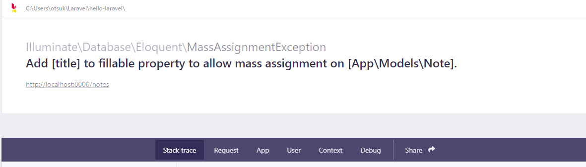
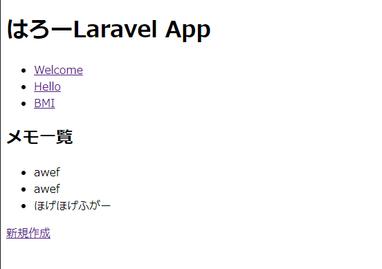

# Laravel入門編 ７章 データベース
前回はLaravelのデータベースの全体像を紹介しました。  
今回はメモ帳アプリを開発しながら具体的なデータベースへのアクセス方法を説明します。  

## Migration
Laravelにはテーブルの作成や編集などのスキーマをPHPのコードで管理する、  
Migrationというものが存在します。

## 直接SQLでスキーマを管理してはだめなのか？
もちろんCREATE TABLEやALTER TABLEで直接テーブルを作成したり編集することも可能ですが、  
Gitなどでバージョンを管理することが難しく、メンテナンスも難しいです。  
途中からALTER TABLEで制約などを追加した場合、どの段階で変更が加わったのか、  
変更が適応されているのかを把握するのが困難です。  
LaravelのMigrationはPHPでテーブルの作成や編集をするため、  
バージョン管理もしやすく、またコマンド一つで実行してくれるため構築するのが楽です。  
またPHPがデータベースのスキーマを知ることができるので、テストなどを自動化するときに、  
自動的にデータベースを初期化したりすることが容易にできるので便利です。  

## メモ帳アプリの仕様
コードを書く前にまず、メモ帳アプリの仕様を決めておきます。  
メモ帳アプリは、タイトルと本文を投稿できることとします。  
タイトルの最大文字数は20文字で、入力は必須とします。  
本文の最大文字数は200文字で、入力は必至とします。  
今回はユーザーの識別はなしで実装します。

## データベースの定義
> テーブル名:notes  

|列名|型|主キー|NOT NULL|外部キー|説明|
|-|-|-|-|-|-|
|id|符号なしbigInt|YES|YES||主キーautoincrementします。|
|title|varchar(20)|NO|YES||タイトル|
|text|varchar(200)|NO|YES||本文|
|created_at|date|No|No||作成日時|
|updated_at|date|No|No||更新日時|

## ルートの仕様
|path|メソッド|名前|コントローラー@メソッド|説明|
|-|-|-|-|-|
|/notes|get|notes|NoteController@index|投稿一覧|
|/notes/{noteId}|notes.show|get|NoteController@show|投稿の詳細画面|
|/notes/new|get|notes.new|NoteController@new|投稿作成画面|
|/notes|post|notes.create|NoteController@store|投稿POST先|

## Noteモデルの作成
ここでMVCモデルのおさらいをします。  
MVCモデルは、プログラムの処理を大まかに３つに分けて開発を行う考え方の一つです。  
その３つはModel, View, Controllerに分けられます。  
* データベースや計算ロジックなどを実装するModel
* 表示を担当するView
* ViewとModelを仲介するController  

今までView(blade)、Controllerを触ってきました。  
今回はMVCの内のMであるModelを触ります。  

まずは、notesテーブルに対応するNoteモデルを作成します。  
**-m オプションは一緒にMigrationを作成してくれます。**
```
php artisan make:model Note -m
```

## Migrationの作成
migrationは```php artisan make:migration```コマンドで作成します。  
今回はModelの作成と同時にMigrationを作成したため、  
さらにMigrationを作る必要はありません。  
Migrationは命名などにルールがあるので後で[ドキュメント](https://readouble.com/laravel/8.x/ja/migrations.html)を読んでおくことをお勧めします

## Migrationの作成場所  
Migrationは./database/migrationsに作成されます。  
その中に先ほど作成した```年_月_日_時間_create_notes_table.php``` migrationファイルがあるのでエディターで開きます。  
(※年月日時間は作成時間によって変わります)

> 2021_01_16_052702_create_notes_table.php

開いてみると以下のような状態になっていると思います。  
CreateNotesTableクラスには  
upメソッドとdownメソッドがあることがわかります。  
|メソッド名|役割|
|-|-|
|up|migrationを実行するときに実行される。|
|down|migrationを取り消したいときに実行される。|


```php
<?php

use Illuminate\Database\Migrations\Migration;
use Illuminate\Database\Schema\Blueprint;
use Illuminate\Support\Facades\Schema;

class CreateNotesTable extends Migration
{
    /**
     * Run the migrations.
     *
     * @return void
     */
    public function up()
    {
        Schema::create('notes', function (Blueprint $table) {
            $table->id();
            $table->timestamps();
        });
    }

    /**
     * Reverse the migrations.
     *
     * @return void
     */
    public function down()
    {
        Schema::dropIfExists('notes');
    }
}

```

## id
主キーのことで型はunsigned bigInteger型の主キー制約でAUTOINCREMENTが設定されます。

## timestamp
date型のupdated_atとcreated_atが作成され、  
作成時、更新時に自動的に時間が記録されます。

## 列を実装する
列を作成する基本的な構文は以下のようになります。
```php
$table->対応する型のメソッド('列名');
```

varchar(20)のtitleを作成したいのでドキュメントを見たところ、  
varcharに対応するのはstringメソッドのようです。  
引数に設定したい列名を渡してあげます。
```php
$table->string('title', 20);
```

引き続きvarchar(200)の本文(text)を作成します。
```php
$table->string('text', 200);
```

他にもいろいろなデータ型の列を宣言することができます。  
[カラムの作成](https://readouble.com/laravel/8.x/ja/migrations.html#creating-columns)


ここまでのコード
```php
<?php

use Illuminate\Database\Migrations\Migration;
use Illuminate\Database\Schema\Blueprint;
use Illuminate\Support\Facades\Schema;

class CreateNotesTable extends Migration
{
    /**
     * Run the migrations.
     *
     * @return void
     */
    public function up()
    {
        Schema::create('notes', function (Blueprint $table) {
            $table->id();
            $table->timestamps();
            $table->string('title', 20);
            $table->string('text', 200);
        });
    }

    /**
     * Reverse the migrations.
     *
     * @return void
     */
    public function down()
    {
        Schema::dropIfExists('notes');
    }
}
```

## データベースの接続設定
早速Migrationを実行してみたいところですが、  
その前にデータベースの接続情報をLaravelに設定する必要があります。  
設定情報は./.envに書きます。
```env

APP_NAME=Laravel
APP_ENV=local
APP_KEY=
APP_DEBUG=true
APP_URL=http://localhost

LOG_CHANNEL=stack
LOG_LEVEL=debug

DB_CONNECTION=mysql
DB_HOST=127.0.0.1
DB_PORT=3306
DB_DATABASE=laravel
DB_USERNAME=root
DB_PASSWORD=

BROADCAST_DRIVER=log
CACHE_DRIVER=file
QUEUE_CONNECTION=sync
SESSION_DRIVER=file
SESSION_LIFETIME=120

MEMCACHED_HOST=127.0.0.1

REDIS_HOST=127.0.0.1
REDIS_PASSWORD=null
REDIS_PORT=6379

MAIL_MAILER=smtp
MAIL_HOST=mailhog
MAIL_PORT=1025
MAIL_USERNAME=null
MAIL_PASSWORD=null
MAIL_ENCRYPTION=null
MAIL_FROM_ADDRESS=null
MAIL_FROM_NAME="${APP_NAME}"

AWS_ACCESS_KEY_ID=
AWS_SECRET_ACCESS_KEY=
AWS_DEFAULT_REGION=us-east-1
AWS_BUCKET=

PUSHER_APP_ID=
PUSHER_APP_KEY=
PUSHER_APP_SECRET=
PUSHER_APP_CLUSTER=mt1

MIX_PUSHER_APP_KEY="${PUSHER_APP_KEY}"
MIX_PUSHER_APP_CLUSTER="${PUSHER_APP_CLUSTER}"

```

MySQLにデータベースを作成していなかったので作成します。
```cmd
mysql -u root -p
MariaDB [(none)]> create database hello_laravel;
Query OK, 1 row affected (0.009 sec)
```

早速設定します。
ポート名やパスワードやユーザー名は環境に合わせて設定してください。
```
DB_CONNECTION=mysql
DB_HOST=127.0.0.1
DB_PORT=3306
DB_DATABASE=hello_laravel
DB_USERNAME=root
DB_PASSWORD=
```

## migrationの実行
以下のコマンドを実行することによってmigrationが実行されます。

```
php artisan migrate
```

また個人的には以下のコマンドをよく使います。  

またmigrationを取り消したいときは
```
php artisan migrate:rollback
```

初期化したいときは
```
php artisan migrate:reset
```

初期化してmigrationしたいときは
```
php artisan migrate:refresh
```

## テーブルが作成されたか確認する
mysqlで確認してみます。  
データベースのテーブルはshow tablesなどで確認できます。
```
MariaDB [hello_laravel]> show tables;
+-------------------------+
| Tables_in_hello_laravel |
+-------------------------+
| failed_jobs             |
| migrations              |
| notes                   |
| password_resets         |
| users                   |
+-------------------------+
5 rows in set (0.000 sec)
```

notesテーブルの情報を見てみましょう。  
仕様通りに作成することができました。
```
MariaDB [hello_laravel]> show columns from notes;
+------------+---------------------+------+-----+---------+----------------+
| Field      | Type                | Null | Key | Default | Extra          |
+------------+---------------------+------+-----+---------+----------------+
| id         | bigint(20) unsigned | NO   | PRI | NULL    | auto_increment |
| created_at | timestamp           | YES  |     | NULL    |                |
| updated_at | timestamp           | YES  |     | NULL    |                |
| title      | varchar(20)         | NO   |     | NULL    |                |
| text       | varchar(200)        | NO   |     | NULL    |                |
+------------+---------------------+------+-----+---------+----------------+
5 rows in set (0.021 sec)
```

## routeとControllerを作成する
作成画面とそのPOST先と一覧画面が必要です。  
そのためのControllerとRouteを作成します。

ルートとControllerの仕様は以下の通りです。
|path|メソッド|名前|コントローラー@メソッド|説明|
|-|-|-|-|-|
|/notes|get|notes|NoteController@index|投稿一覧|
|/notes/{noteId}|notes.show|get|NoteController@show|投稿の詳細画面|
|/notes/new|get|notes.new|NoteController@new|投稿作成画面|
|/notes|post|notes.create|NoteController@store|投稿POST先|

## Controllerを作成する
```
php artisan make:controller NoteController
```

ルーティングします。
> routes/web.php
```php
use App\Http\Controllers\NoteController;

/* 以前書いたコードは省略しています。 */
Route::get('/notes', [NoteController::class, 'index'])->name('notes');
Route::get('/notes/new', [NoteController::class, 'new'])->name('notes.new');
Route::get('/notes/{noteId}', [NoteController::class, 'show'])->name('get')->where(['noteId' => '[0-9]+']);
Route::post('/notes', [NoteController::class, 'store'])->name('notes.create');

```
## 作成フォームを作成する
少しデータベースの話から外れてしまいますが、  
bladeで作成フォームを作成します。  
(本題はbladeの作成ではないのでコピペしてもらっても構いません)
新たにbladeファイルを作成します。  
```touch ./resources/views/new_note.blade.php```

> new_note.blade.php
```html
@extends('layouts.app')

@section('title')
メモを作成
@endsection
@section('content')
<form method="POST" action="{{ route('notes.create') }}">
    @csrf

    <div>
        タイトル:<input type="text" name="title" value="{{ old('title') }}">
        @error('title') 
            <p> {{ $message }}</p> 
        @enderror
    </div>
    <div>
        <p>本文:</p>
        <textarea type="text" name='text'>
            {{ old('text')}}    
        </textarea>
        @error('text')
            <p> 
                {{ $message }}
            </p>
        @enderror
    
    </div>
    <div>
        <button type="submit">作成</button>
    </div>
</form>
@endsection    
```

## 作成フォームを表示できるようにする
NoteControllerのnewメソッドからnew_noteを表示するようにします。
> NoteController.php
```php
public function new()
{
    return view('new_note');
}
```

## 入力値チェックを作成する
```
php artisan make:request CreateNoteRequest
```

```php
<?php

<?php

namespace App\Http\Requests;

use Illuminate\Foundation\Http\FormRequest;

class CreateNoteRequest extends FormRequest
{
    /**
     * Determine if the user is authorized to make this request.
     *
     * @return bool
     */
    public function authorize()
    {
        return true;
    }

    /**
     * Get the validation rules that apply to the request.
     *
     * @return array
     */
    public function rules()
    {
        return [
            'title' => ['required', 'max:20'],
            'text' => ['required', 'max:200']
        ];
    }
}

```

## /notes postを受けれるようにする
作成ボタンを押してもNoteControllerのstoreメソッドが存在しないため、  
エラーが表示されてしまいます。  
POSTリクエストとそのパラメーターを受け取り、  
データベースに挿入する処理を実装します。

NoteとCreateNoteRequestをuseするのを忘れないでください。
> NoteController.php

```php
use App\Models\Note;
use App\Http\Requests\CreateNoteRequest;
```

Modelに対してcreateメソッドを呼び出すことでデータベースに挿入することができます。  
createメソッドはカラム名をkey、挿入するデータをvalueとする連想配列を受けます。
> NoteController.php
```php
public function store(CreateNoteRequest $request)
{
    // title, textを連想配列で取得します。
    $params = $request->only('title', 'text');

    $crated_note = Note::create($params);
}
```

## 送信してみる
適当に文字を入れて送信します。  
データが作成さ・・エラーが出てしまいました。  



fillメソッドやcreateメソッド、updateメソッドなどで更新をするときは、  
$fillableに注入するデータの許可をしておかないといけません。

app\Models\Note.phpをエディターで開きます。  
```php
<?php

namespace App\Models;

use Illuminate\Database\Eloquent\Factories\HasFactory;
use Illuminate\Database\Eloquent\Model;

class Note extends Model
{
    use HasFactory;
    
    // 追加する
    protected $fillable = ['title', 'text'];
}

```

再度作成してみます。  
特にリダイレクトも何もしていないので真っ白な画面が表示されます。  
直接データベースを確認してみます。  
新たにレコードが挿入されていれば成功です。
```
MariaDB [hello_laravel]> select * from notes;
+----+---------------------+---------------------+-------+----------+
| id | created_at          | updated_at          | title | text     |
+----+---------------------+---------------------+-------+----------+
|  1 | 2021-01-16 07:30:20 | 2021-01-16 07:30:20 | awef  | awefawef |
+----+---------------------+---------------------+-------+----------+
1 row in set (0.000 sec)
```

## 一覧画面に遷移する
作成後何も表示されないのはUXとしてはだめなので、  
とりあえず一覧画面に遷移するようにします。  
NoteControllerのstoreメソッドの最後の行に追加してください。
```php
return redirect()->route('notes');
```

## 一覧画面を実装する

bladeファイルを作成します。  
名前は```notes.blade.php```にしました。  
Noteをnotesという配列で受け取りそれをforeachを使って一覧表示しています。

```html
@extends('layouts.app')

@section('title')
メモ一覧
@endsection

@section('content')
<div>
    <h2>メモ一覧</h2>
    <ul>
        @foreach($notes as $note)
            <li>
                <!--詳細画面のリンクを設定する-->
                <a href="{{ route('get', ['noteId' => $note->id ])}}">
                    <!-- タイトルを表示する -->
                    {{ $note->title }}
                </a>
            </li>
        @endforeach
    </ul>
    <a href="{{ route('notes.new')}}">新規作成</a>
</div>
@endsection
```

## indexメソッドを実装する
データベースからNoteを取得して、  
それをnotes.blade.phpに渡すためのindexメソッドを実装します。
```php
public function index()
{
    // すべて取得
    // select * from notes;
    $notes = Note::all();

    return view('notes', ['notes' => $notes]);
}
```

## 動作確認
作成したメモのタイトルが一覧表示されていると思います。  


## 詳細画面
```html
@extends('layouts.app')

@section('title')
{{ $note->title }}
@endsection

@section('content')
<div>
    <h2>{{ $note->title }}</h2>
    <p>
        {{ $note->text }}
    </p>
    <a href="{{ route('notes')}}">一覧へ</a>
</div>
@endsection
```

## コントローラーを実装
仕様とその実装であるルーターによると、  
NoteControllerのshowメソッドが詳細表示用のメソッドのようです。 
```php
Route::get('/notes/{noteId}', [NoteController::class, 'show'])->name('get')->where(['noteId' => '[0-9]+']);
``` 

## showメソッドを実装
$noteIdパラメーターを引数から受けます。
```php
public function show($noteId)
{
    // noteIdをもとにNoteを取得します。
    // select * from notes where id = $noteId limit 1;
    // $noteIdのノートが存在しなかった場合404 Not foundが表示されます
    $note = Note::findOrFail($noteId);
    return view('notes_detail', ['note' => $note]);

}
```

正しく実装されていれば一覧表示のリンクをクリックすると、  
詳細画面へ遷移すると思います。

## まとめ
migrationの役割とレコードの挿入方法を紹介しました。  
データベースからデータを読み取って表示する方法を紹介しました。   
次回は更新と削除の実装をしたいと思います。